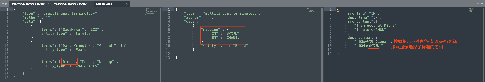

# DynamoDB-RAG

目标：利用RAG召回的元数据，更好的支持翻译, VOC等任务。

适用场景：存在大量的专有名词(无须翻译), 存在大量的不同语言之间的标准映射，不能够一次性把这些元信息添加到PE。

实现方式：整个方案全部是离线的，元数据摄入和RAG pipeline 均通过Glue Job进行调度

部署文档：[飞书](https://amzn-chn.feishu.cn/docx/HxO8dK41UosPFvxAylScW6Xunah?from=from_copylink)

原型效果参考：

