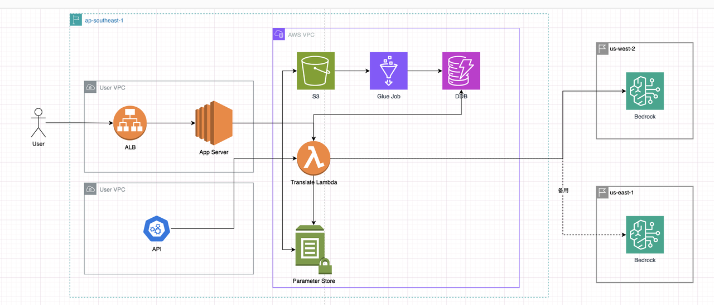

<p align="center">
    &nbsp<strong>English</strong>&nbsp ｜ <a href="README_ZH.md"><strong>简体中文</strong></a>&nbsp 
</p>
<br>

# Rag-based-translation-with-dynamodb-and-bedrock

### Demo

 

### Architecture Diagram



### Applicable Scenarios

There are a large number of proprietary terms (that don't need translation) and numerous standard mappings between different languages, which cannot be added to prompt at once.

### Implementation details

Use DynamoDB to store mapping relationships for a large number of specialized terms. The metadata ingestion part is scheduled through Glue Job. The invocation part can be done offline (Glue job) or online (Lambda).

### Deployment Doc

[Lark](https://amzn-chn.feishu.cn/docx/TTFrdxWQ6oIh9txhAYvcxzO0nec)

### Contributors

- [yihuh](https://github.com/readybuilderone)
- [ybalbert](https://github.com/ybalbert001)

### Invocation Examples

- Online invocation through Lambda (three request types: segment_only|term_mapping|translate)
    [Note] You need to specify the dictionary_id, which is the name of the corresponding specialized term mapping dictionary
    - Segmentation only

        payload reference
        ```json
        {
            "src_contents": [
                "奇怪的渔人吐司可以达到下面效果，队伍中所有角色防御力提高88点，持续300秒。多人游戏时，仅对自己的角色生效。《原神手游》赤魔王图鉴，赤魔王能捉吗" 
            ],
            "src_lang":"zh-cn",
            "dest_lang":"en-us",
            "request_type":"segment_only",
            "dictionary_id": "dictionary_1",
            "model_id":"anthropic.claude-3-sonnet-20240229-v1:0"
        }
        ```
        response reference
        ```json
        {
          "translations": [
            {
              "words": [
                "赤魔王",
                "奇怪的渔人吐司",
                "防御力"
              ]
            }
          ]
        }
        ```
    - Retrieve term mapping

        payload reference
        ```json
    {
        "src_contents": [ 
                "奇怪的渔人吐司可以达到下面效果，队伍中所有角色防御力提高88点，持续300秒。多人游戏时，仅对自己的角色生效。《原神手游》赤魔王图鉴，赤魔王能捉吗" 
            ],
        "src_lang":"zh-cn",
        "dest_lang":"en-us",
        "request_type":"term_mapping",
        "dictionary_id": "dictionary_1",
        "model_id":"anthropic.claude-3-sonnet-20240229-v1:0"
    }
        ```
        response reference
        ```json
        {
          "translations": [
            {
              "term_mapping": [
                [
                  "赤魔王",
                  "Akai Maou",
                  "Serenitea Pot家园"
                ],
                [
                  "奇怪的渔人吐司",
                  "Suspicious Fisherman's Toast",
                  "Material 材料"
                ],
                [
                  "防御力",
                  "DEF",
                  "Artifact Stats 圣遗物属性"
                ]
              ]
            }
          ]
        }
        ```
    - translate
        payload reference
        ```json
        // [request1]zh-cn => en-us
        {
            "src_contents": [
                "奇怪的渔人吐司可以达到下面效果，队伍中所有角色防御力提高88点，持续300秒。多人游戏时，仅对自己的角色生效。《原神手游》赤魔王图鉴，赤魔王能捉吗"
            ],
            "src_lang":"zh-cn",
            "dest_lang":"en-us",
            "request_type":"translate",
            "dictionary_id": "dictionary_1",
            "model_id":"anthropic.claude-3-sonnet-20240229-v1:0"
        }

        // [request2]zh-cn => en-us
        {
            "src_contents": [
                "奇怪的渔人吐司可以达到下面效果，队伍中所有角色防御力提高88点，持续300秒。多人游戏时，仅对自己的角色生效。《原神手游》赤魔王图鉴，赤魔王能捉吗"
            ],
            "src_lang":"zh-cn",
            "dest_lang":"en-us",
            "request_type":"translate",
            "dictionary_id": "dictionary_1",
            "model_id":"anthropic.claude-3-sonnet-20240229-v1:0",
            "response_with_term_mapping" : true
        }

        // [request3]en-us => zh-cn (with no translation tag)
        {
            "src_contents": [
                "Dear Traveler, \n\nThe Genshin Impact Version 4.6 <span class=\"notranslate\">\"Two Worlds Aflame, the Crimson Night Fades\"</span> update is coming soon. Registration for the Twitch Livestream Event has started."
            ],
            "src_lang":"en-us",
            "dest_lang":"zh-cn",
            "request_type":"translate",
            "dictionary_id": "dictionary_1",
            "model_id":"anthropic.claude-3-haiku-20240307-v1:0"
        }

        // [request4]zh-cn => en-us (with misleading translation direction)
        {
            "src_contents": [
                "Dear Traveler,\n\n原神版本 4.6 <span class=\"notranslate\">\"Two Worlds Aflame, the Crimson Night Fades\"</span> update is coming soon. Registration for the Twitch Livestream Event has started.\n\nEvent Timeline      \n\nRegistration Period: April 19 at 19:00:00 – April 26 at 15:00:00 (UTC+8)        \n\nStreaming Period: April 24 after the version update to May 14, 23:59:59 (UTC+8)     \n\nNote: Participants who successfully register before April 24 at 00:00:00 (UTC+8) will be able to start streaming after the Version 4.6 update. Participants who register after April 24 at 00:00:00 (UTC+8) will need to wait until April 27 at 00:00:00 (UTC+8) to start streaming.        \n\nReward Calculation: May 15 – May 30     \n\n*Primogem rewards will be delivered to valid participants' accounts no later than 30 business days after the reward calculation period has concluded.\n\n*Cash rewards will be delivered to valid participants' accounts no later than 45 business days after the reward calculation period has concluded.       \n\nEmail Notification: Participants will receive a welcome email with event details from April 26 – April 30. Reward notification emails will be sent within 30 business days after the reward calculation period ends, to the accounts of all participants. Please pay attention to these messages.               \n\nEvent Details       \n\n1. Participants who meet the following conditions will be able to obtain the corresponding rewards:     \n\na. Sign up for the Version 4.6 Twitch Livestream Event      \n\nb. Link an Email to a HoYoverse account     \n\nc. This event is open to Genshin Impact accounts registered on the following four servers: America, Europe, Asia, and (TW, HK, MO).     \n\nd. During the event, participants must stream in the Genshin Impact category on Twitch for a total duration of 6 hours or more in order to qualify for the \"Start Streaming\" and \"Aim for the Leaderboard\" rewards.     \n\n2. Participants who successfully register before April 24 at 00:00:00 (UTC+8) will be able to start streaming after the Version 4.6 update. Participants who register after April 24 at 00:00:00 (UTC+8) will need to wait until April 27 at 00:00:00 (UTC+8) to start streaming.       \n\n3. Primogem rewards will be delivered to valid participants' accounts no later than 30 business days after the event has concluded.     \n\n4. Any form of cheating or negligence within the community, event, or platform will not be tolerated and can result in indefinite suspension from future or related events.     \n\na. Example of cheating: Streamer A logs into Genshin Impact and is AFK for 24 hours.        \n\nb. Example of negligence: Streaming games/content that are not related to Genshin Impact in the Genshin Impact category in an attempt to get Primogems.\n\n5. Disclosing or discussing the content of an upcoming release will not be tolerated and can result in indefinite suspension from future or related events."
            ],
            "src_lang":"zh-cn",
            "dest_lang":"en-us",
            "request_type":"translate",
            "dictionary_id": "dictionary_1",
            "model_id":"anthropic.claude-3-haiku-20240307-v1:0",
            "max_content_length" : 102400
        }

        // [request5]en-us => zh-cn (upper/lower sensitive problem)
        {
            "src_contents": [
                "akai maou is an great character"
            ],
            "src_lang":"en-us",
            "dest_lang":"zh-cn",
            "request_type":"translate",
            "dictionary_id": "dictionary_1",
            "model_id":"anthropic.claude-3-haiku-20240307-v1:0"
        }
        ```
        response reference
        ```json
        //resp1
        {
          "translations": [
            {
              "translated_text": "Suspicious Fisherman's Toast can achieve the following effect: All characters in the team gain 88 DEF for 300 seconds. In multiplayer mode, this effect only applies to your own characters. Akai Maou Handbook in \"Genshin Impact\", can Akai Maou be caught?",
              "model": "anthropic.claude-3-sonnet-20240229-v1:0",
              "glossary_config": {
                "glossary": "dictionary_1"
              }
            }
          ]
        }

        //resp2
        {
          "translations": [
            {
              "term_mapping": [
                [
                  "赤魔王",
                  "Akai Maou",
                  "Serenitea Pot家园"
                ],
                [
                  "奇怪的渔人吐司",
                  "Suspicious Fisherman's Toast",
                  "Material 材料"
                ],
                [
                  "防御力",
                  "DEF",
                  "Artifact Stats 圣遗物属性"
                ]
              ],
              "translated_text": "Suspicious Fisherman's Toast can achieve the following effect: All characters in the team gain 88 DEF for 300 seconds. In multiplayer mode, this effect only applies to your own characters. Akai Maou Handbook in \"Genshin Impact\", can Akai Maou be caught?",
              "model": "anthropic.claude-3-sonnet-20240229-v1:0",
              "glossary_config": {
                "glossary": "dictionary_1"
              }
            }
          ]
        }

        //resp3
        {
          "translations": [
            {
              "translated_text": "亲爱的旅人,\n\n原神4.6版本<span class=\"notranslate\">\"Two Worlds Aflame, the Crimson Night Fades\"</span>更新即将到来。Twitch直播活动的注册已经开始。",
              "model": "anthropic.claude-3-haiku-20240307-v1:0",
              "glossary_config": {
                "glossary": "dictionary_1"
              }
            }
          ]
        }

        //resp4
        {
          "translations": [
            {
              "translated_text": "Dear Traveler,\n\nThe Genshin Impact Version 4.6 <span class=\"notranslate\">\"Two Worlds Aflame, the Crimson Night Fades\"</span> update is coming soon. Registration for the Twitch Livestream Event has started.\n\nEvent Timeline      \n\nRegistration Period: April 19 at 19:00:00 – April 26 at 15:00:00 (UTC+8)        \n\nStreaming Period: April 24 after the version update to May 14, 23:59:59 (UTC+8)     \n\nNote: Participants who successfully register before April 24 at 00:00:00 (UTC+8) will be able to start streaming after the Version 4.6 update. Participants who register after April 24 at 00:00:00 (UTC+8) will need to wait until April 27 at 00:00:00 (UTC+8) to start streaming.        \n\nReward Calculation: May 15 – May 30     \n\n*Primogem rewards will be delivered to valid participants' accounts no later than 30 business days after the reward calculation period has concluded.\n\n*Cash rewards will be delivered to valid participants' accounts no later than 45 business days after the reward calculation period has concluded.       \n\nEmail Notification: Participants will receive a welcome email with event details from April 26 – April 30. Reward notification emails will be sent within 30 business days after the reward calculation period ends, to the accounts of all participants. Please pay attention to these messages.               \n\nEvent Details       \n\n1. Participants who meet the following conditions will be able to obtain the corresponding rewards:     \n\na. Sign up for the Version 4.6 Twitch Livestream Event      \n\nb. Link an Email to a HoYoverse account     \n\nc. This event is open to Genshin Impact accounts registered on the following four servers: America, Europe, Asia, and (TW, HK, MO).     \n\nd. During the event, participants must stream in the Genshin Impact category on Twitch for a total duration of 6 hours or more in order to qualify for the \"Start Streaming\" and \"Aim for the Leaderboard\" rewards.     \n\n2. Participants who successfully register before April 24 at 00:00:00 (UTC+8) will be able to start streaming after the Version 4.6 update. Participants who register after April 24 at 00:00:00 (UTC+8) will need to wait until April 27 at 00:00:00 (UTC+8) to start streaming.       \n\n3. Primogem rewards will be delivered to valid participants' accounts no later than 30 business days after the event has concluded.     \n\n4. Any form of cheating or negligence within the community, event, or platform will not be tolerated and can result in indefinite suspension from future or related events.     \n\na. Example of cheating: Streamer A logs into Genshin Impact and is AFK for 24 hours.        \n\nb. Example of negligence: Streaming games/content that are not related to Genshin Impact in the Genshin Impact category in an attempt to get Primogems.\n\n5. Disclosing or discussing the content of an upcoming release will not be tolerated and can result in indefinite suspension from future or related events.",
              "model": "anthropic.claude-3-haiku-20240307-v1:0",
              "glossary_config": {
                "glossary": "dictionary_1"
              }
            }
          ]
        }

        //resp5
        {
          "translations": [
            {
              "translated_text": "赤魔王是一个很棒的角色",
              "model": "anthropic.claude-3-haiku-20240307-v1:0",
              "glossary_config": {
                "glossary": "dictionary_1"
              }
            }
          ]
        }
        ```