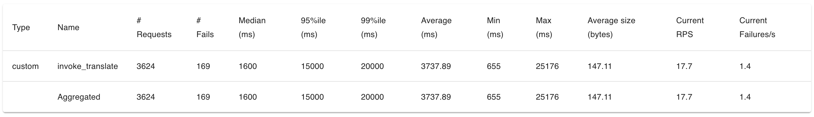
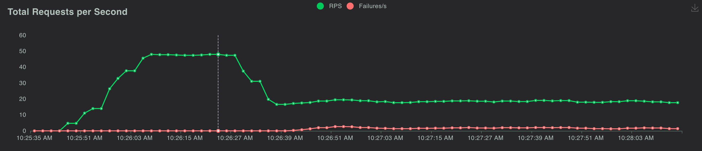
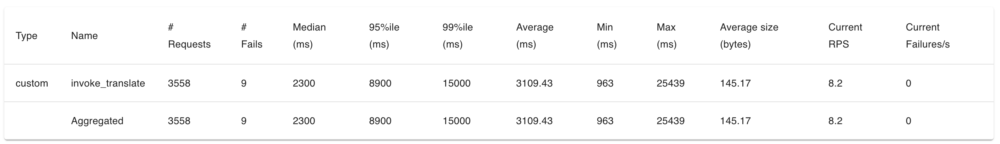
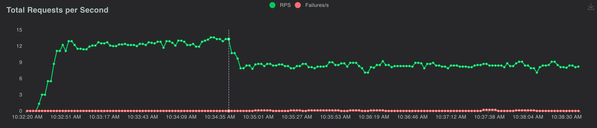
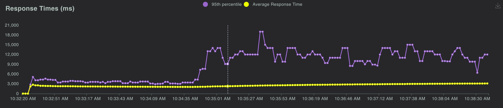

## 测试方法

```bash
pip install -r requirements.txt


# 设置ak/sk 以及region
export ak='AKIA2******U7OO6'
export sk='SpU4F2SkbDu***********LW8lw9hM'
export region='us-west-2'
export model_id='anthropic.claude-3-haiku-20240307-v1:0'
#export model_id='anthropic.claude-3-sonnet-20240229-v1:0'
export dict_id = 'test'

locust --host=http://localhost:8080 --locustfile locustfile.py
# locust -f locustfile.py --headless -u 1 -r 1 #不使用web界面
```


## 测试结论

- claude3-haiku (具体见locust截图)
	- 默认RPM Limit 为 1000, 对应 RPS Limit 为 1000 / 60 = 16.6
	- 实测RPS 约为 17.7
	
	
	


- claude3-sonnet (具体见locust截图)
	- 默认RPM Limit 为 500, 对应 RPS Limit 为 500 / 60 = 8.3
	- 实测RPS 约为 8.2
	
	
	
